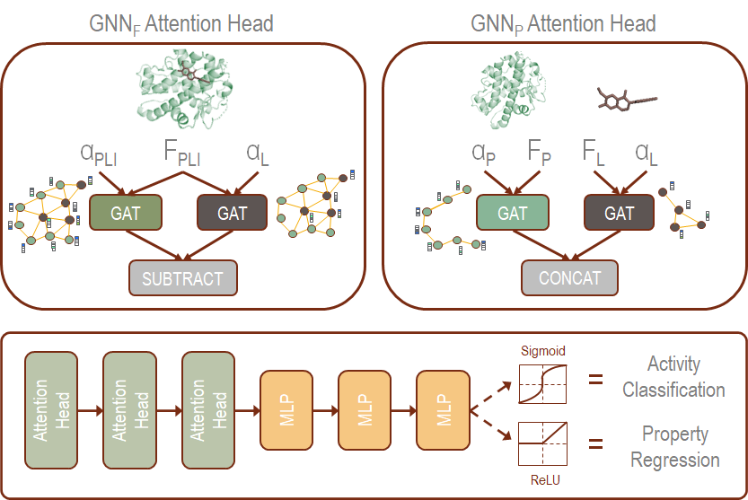

**Decoding the Protein-ligand InteractionsUsing Parallel Graph Neural Networks**



**Requirements**


python                    3.6.1\\
rdkit                     2020.03.3.0
biopython                 1.78
openbabel                 2.4.1

numpy                     1.19.2

scipy                     1.5.2

torchvision               0.7.0


Conda enviroment is highly recommended for this implementation

**Data Preparation for classification models**


Data preperation requires the ligand and protein to be in a mol format readable by rdkit
.mol, .mol2, and .pdb are readily handled by rdkit
.sdf is easily handled with openbabel conversion, made convenient with the pybel wrapper

Both files can then be fed into extractM2.py where the cropping window can be adjusted on line 29
For easy model integration it is best to store the m2 protein window produced by the
extract script along with the original protein ex: pickle.dump((m1,m2), file)

Once cropped complexes are stored, their numpy featurization files can be created.
Files for the different models are labeled in the Data_Prep directory

**Data Preparation for regression models**


The data needs to be in mol format as similar to classification models. 
We have provided some sample mol files representing protein and ligand.
Here the protein is cropped at 8Å window using the extract script as mentioned previously.

The cropped protein-ligand can be used to create features in numpy format. 
Sample training and test keys along with the corresponding pIC<sub>50</sub> and experimental-binding-affinity (EBA) labels are provided in keys folder.
All the files are saved in pickle format with train and test keys as list and the label files as disctionary with key corresponding to the train/test key and value corresponding to the label. The prepare_eba_data.py and prepapre_pic50_data.py uses the cropped protein-ligand mol files to create the correspnding features for the model and save them in compressed numpy file format in the corresponding numpy directory.

These scripts can be called as:

```python
python repare_pic50_data.py <path to pkl-mol directory> <path to save numpy features>
```
```python
python repare_eba_data.py <path to pkl-mol directory> <path to save numpy features>
```
**Training**


Below is an example of the training command. Additional options can be added to the 
argument parser here (learning rate, layer amount and dimension, etc). Defaults are
in place for undeclared parameters including a save directory. 

**Classfication models**

```python
python -W ignore -u train.py --dropout_rate=0.3 --epoch=500 --ngpu=1 --batch_size=32 --num_workers=0  --train_keys=<your_training_keys.pkl>  --test_keys=<your_test_keys.pkl>
```

**Regression models**

```python
python -W ignore -u train.py --dropout_rate=0.3 --epoch=500 --ngpu=1 --batch_size=1 --num_workers=0 --data_dir=<path to feature-numpy folder> --train_keys=<your_training_keys.pkl>  --test_keys=<your_test_keys.pkl>
```


The save directory stores each epoch as a .pt allowing the best model inatance to be loaded
later on
Training and test metrics such as loss and ROC are stored in the same directory for each GPU
used. Ex 3 GPUS: log-rank1.csv, log-rank2.csv, and log-rank3.csv
